# Project
- [Project](#project)
  - [Installing Stable Diffusion locally](#installing-stable-diffusion-locally)
    - [Installing homebrew](#installing-homebrew)
    - [Installing tools](#installing-tools)
    - [Cloning the AUTOMATIC1111 Web UI](#cloning-the-automatic1111-web-ui)
  - [Run Web UI](#run-web-ui)
  - [TouchDesigner with Stable Diffusion Tutorial](#touchdesigner-with-stable-diffusion-tutorial)
    - [Setting up TouchDesigner Project](#setting-up-touchdesigner-project)
    - [Adding music](#adding-music)
    - [Analying audio](#analying-audio)
    - [Creating the audio reactive visual](#creating-the-audio-reactive-visual)
      - [Create position and color of elements](#create-position-and-color-of-elements)
      - [Adding geometry](#adding-geometry)
      - [Adding geometry instances](#adding-geometry-instances)
        - [Positioning the instances](#positioning-the-instances)
        - [Adding color to the instances](#adding-color-to-the-instances)
        - [Adding rotation to the instances](#adding-rotation-to-the-instances)
        - [Adding animation](#adding-animation)
      - [Adding displacement](#adding-displacement)
      - [Adding noise](#adding-noise)
      - [Adding out node](#adding-out-node)
    - [Connecting audio reactive visual to stable diffusion](#connecting-audio-reactive-visual-to-stable-diffusion)
    - [Set up SD\_API](#set-up-sd_api)
    - [Set up prompt window](#set-up-prompt-window)
    - [Image generation settings](#image-generation-settings)
    - [Viewing the image in the background](#viewing-the-image-in-the-background)
    - [Adding feedback loop](#adding-feedback-loop)
    - [Adding logic to change frame when image is generated](#adding-logic-to-change-frame-when-image-is-generated)
    - [Adding frames](#adding-frames)
    - [Binding keep generating to record button](#binding-keep-generating-to-record-button)
    - [Start recording and generating images](#start-recording-and-generating-images)
    - [Using gpuhub for generation](#using-gpuhub-for-generation)
  - [Getting song information](#getting-song-information)
  - [Resources](#resources)
  - [Installing StreamDiffusion](#installing-streamdiffusion)
    - [Clone repo](#clone-repo)
    - [Create virtual environment](#create-virtual-environment)


> [Miro Board](https://miro.com/app/board/uXjVKceCfjg=/?share_link_id=851998708211)

## Installing Stable Diffusion locally
Taken from the guide at [stable-diffusion-art.com](https://stable-diffusion-art.com/install-mac/). Guide from AUTOMATIC1111 [github.com - Installation on Apple Silicon](https://github.com/AUTOMATIC1111/stable-diffusion-webui/wiki/Installation-on-Apple-Silicon)
### Installing homebrew
To install tools needed, we use homebrew, a package manager for macOS.
Installation can be found on [brew.sh](https://brew.sh/)

### Installing tools
There are some tools required to install first, these are python, wget and python:
```shell
brew install python@3.10 git wget
```

### Cloning the AUTOMATIC1111 Web UI
To get the Stable Diffusion WebUI, clone the git repository:
```shell
git clone https://github.com/AUTOMATIC1111/stable-diffusion-webui
```

## Run Web UI
The Web UI can be started after installing the tools and cloning the repo. Navigate to the repo and run the `webui.sh`:
```shell
cd stable-diffusion-webui
./webui.sh
```

This will take some time as it is also downloading some initial requirements.

After completing the startup, we should be able to access the Web UI on a local URL.


## TouchDesigner with Stable Diffusion Tutorial
Based on [youtube.com - elekktronaut - Touch Designer x Stable Diffusion Tutorial 1](https://www.youtube.com/watch?v=4wpn_3JNaIc)

### Setting up TouchDesigner Project
- Create new base
- Right click on base and `Add Component Time`
- 
- Go inside base and then go inside local base
- Set the rate of the time to `cookRate()` and set play to 0
- 
- Set the base to run independently
- 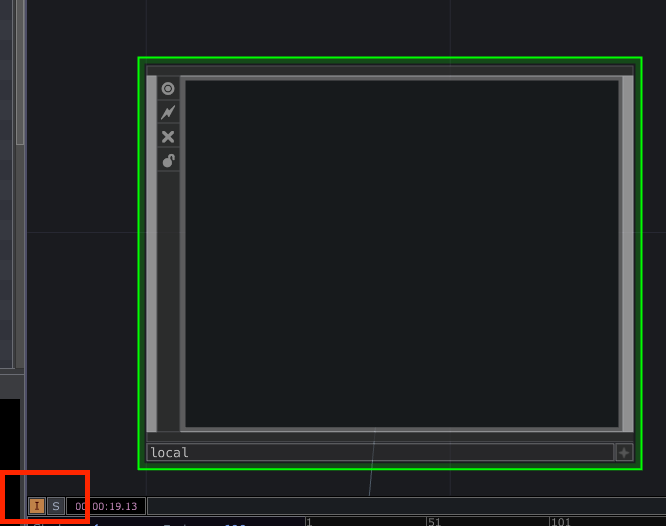

### Adding music
- Add audio file in chop
- Add info chop and drag the audio file in chop onto the info chop
- Set the file_length_frames as our timeline length
- 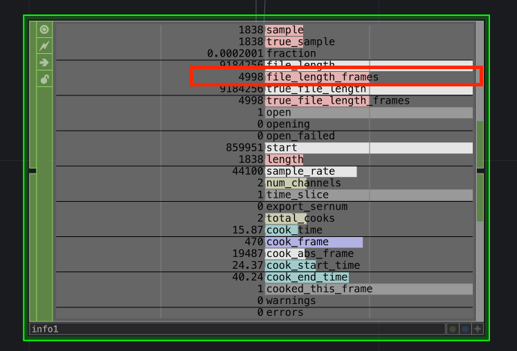
- 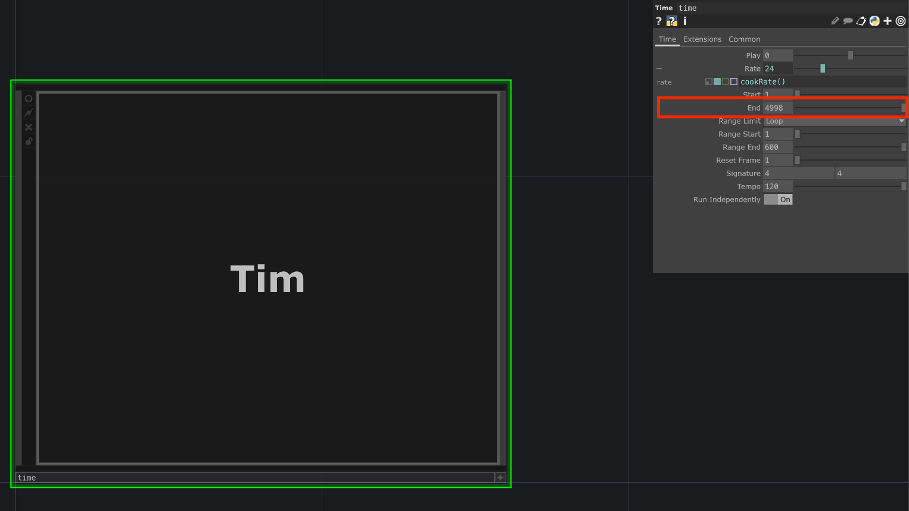
- Also set the range end to `me.par.end` to set the range to match the timeline
- Set the play mode of the audio file in to `Lcoked to Timeline` to navigate the audio on the timeline
- Add a audio device out after the audio file in

### Analying audio
- Add a math node after the audio file in and set combine channels to average. This will combine the two channels.
- Add audio spectrum after math
- Increase high frequency boost of audio spectrum
- Add a null afterwards
- right click and `collapse selected`
- The audio setup should look like this:
- 

### Creating the audio reactive visual
#### Create position and color of elements
- Navigate into the new base
- Add resample chop and set the sample rate to 60, this will provide us with the amount of elements that we will create later on
- Set time slice to off
- Add a chop to  and change pixel format to 32-bit float rgba
- 
- Add noise
  - Set output to noise only
  - Set period to .2
  - Set harmonics to 0
  - Set offset to 0
  - Turn off monochrome
- Add math to change range later on
- Add null afterwards
- From chop to, add another noise node
  - Set output to noise only
  - Set exponent to .7
  - Set offset to .7
- Add lookup
- Add ramp as second input for lookup
- Set ramp colors
- Add null afterwards
- 

#### Adding geometry
- Add circle sop
- Add transform sop
  - Change uniform scale to .2
- Add geometry comp
- Add camera
- Add render top
- 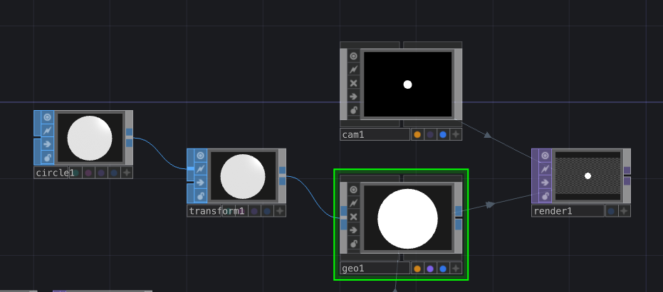
- Add constant material, drag onto geometry
- Add noise top, drag onto constant material
  - Set Amplitude to .1
  - Set offset to .9
  - Set period to 2
- 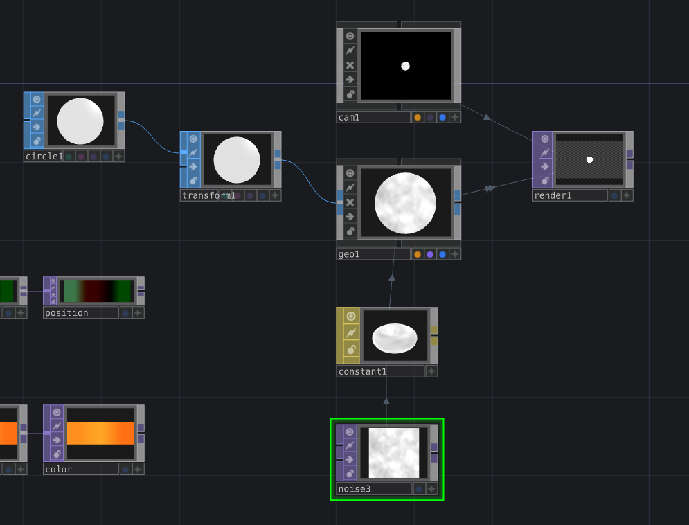
- Set resolution of render to someting reasonable that works well with stable diffusion
- E.g. 576x768
- Add out node after render node
- Set camera background color to 1
- 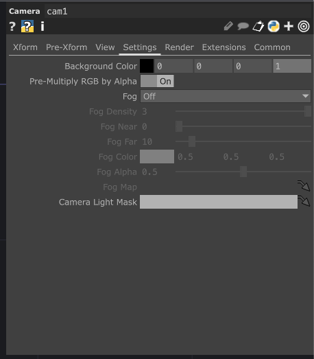

#### Adding geometry instances
- Set the instancing to on on the geometry

##### Positioning the instances
- Set the position null as the Translate OP
  - Set Translate X ro r
  - Set Translate Y to g
- 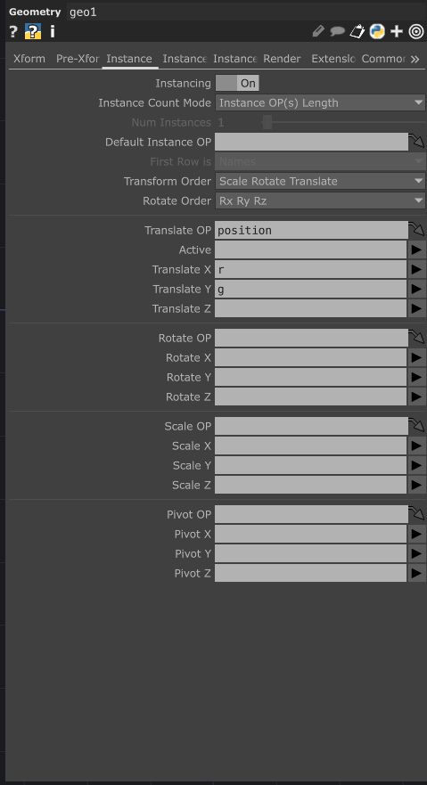
- Change to R and G range to better values in the math node that we created before(e.g. r to 3 and g to 4)
  - 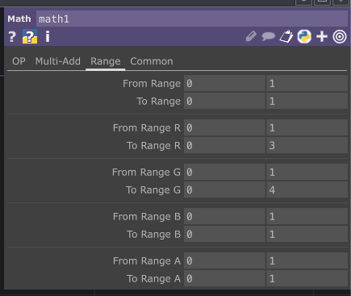
- 
##### Adding color to the instances
- On the Instance 2 of the geometry, set the Color OP to color node
- Change the rgb to rgb of the color node
- 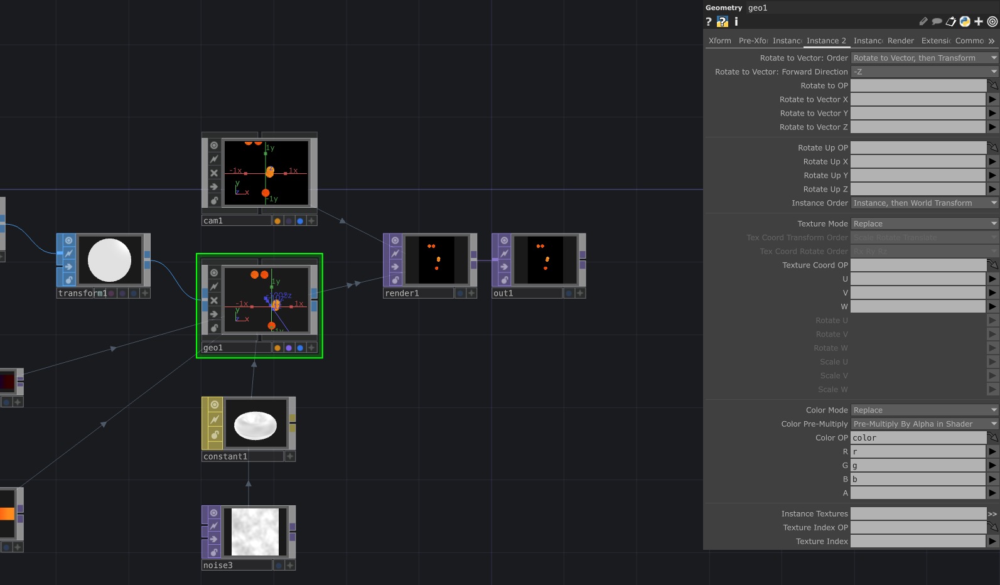

##### Adding rotation to the instances
- To change the rotation of the textures, add a noise after the noise that comes after the chop to
  - Set the output to noise only
  - Change seed
- Add math node after noise
  - Adjust to range to 0 to 360
- Add null, call it rotation
- Drag rotation null onto Rotate OP of Instance on Geometry
  - Set rotate z to r
- 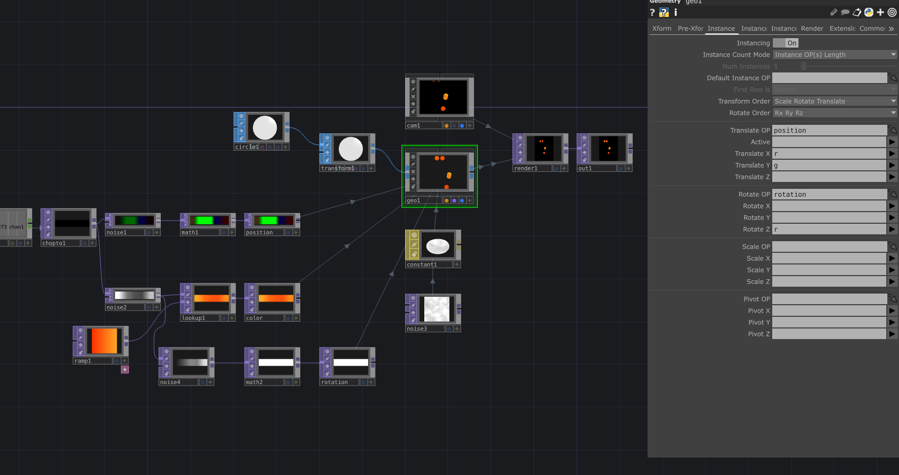

##### Adding scale to the instances
- From the resample node, add a math node
  - Set to range to .3 and 6
- Add lag
  - Turn on lag per sample
- Add null, call it scale
- Drag it onto geometry
- Use chan1 for x and y scale
- 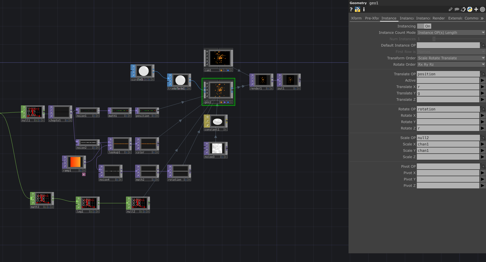

##### Adding animation
- From resample node, add analyze node
- Add math node
- Add lag node
  - Set lag start to .02
- Add speed node
- Add null node, call it animation
- Make the null viewer active
- Drag the null node onto the z translate of all three noises in geometry setup
  - Select chop reference
- This will push our noises forward in the animation
- 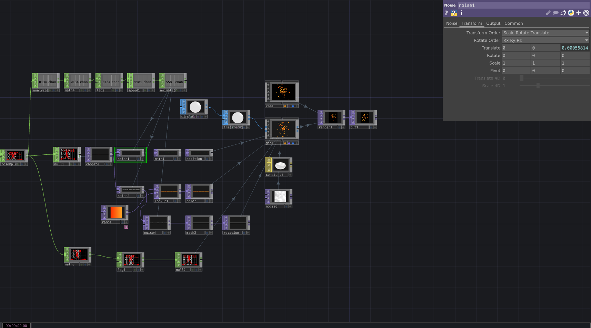

#### Adding displacement
- Navigate out a layer
- Add displace node after the circles node
  - Set displace weight to .05 on both axes
- Add noise node after the circles node
  - Set output to just noise
  - Turn off monochrome
  - Connect to displace node
  - Set amplitude to .3
- 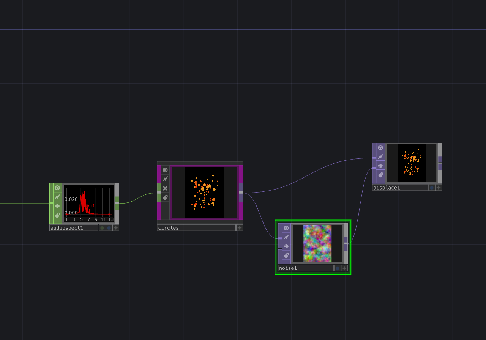

#### Adding noise
- Add noise node
  - Set to Random GPU
  - Set amplitude to .2
  - Set offset to 0
  - Turn off monochrome
- Add another noise node
  - Set amplitude to .24
  - Set offset to .8
  - Set output to input * noise
- 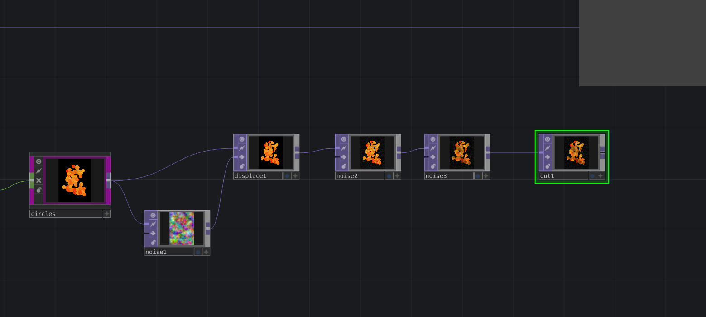

#### Adding out node
- Add an out node

### Connecting audio reactive visual to stable diffusion
-  Navigate out a layer
-  Add null after base, call it input
-  Connect input to SD_API

### Set up SD_API
- Set web ui folder
- Launch web ui with --api flag
- Check if the port is matching with touchdesigner
- Change mode to image to image
- Select model to use

### Set up prompt window
- Add text dat
  - Call it p0
  - Insert prompt from tutorial: ultrarealistic surreal flowers, ultra detailed, texture, generative art, focus, wes anderson, kodak, light and shadow
- Add convert dat
- Add null, call prompt
- Drag null onto prompt of SD_API, add [0,0]
- Do the same steps for negative prompt
- Negative prompt
  - artstation, dots, lines, copyright, logo, watermark
- 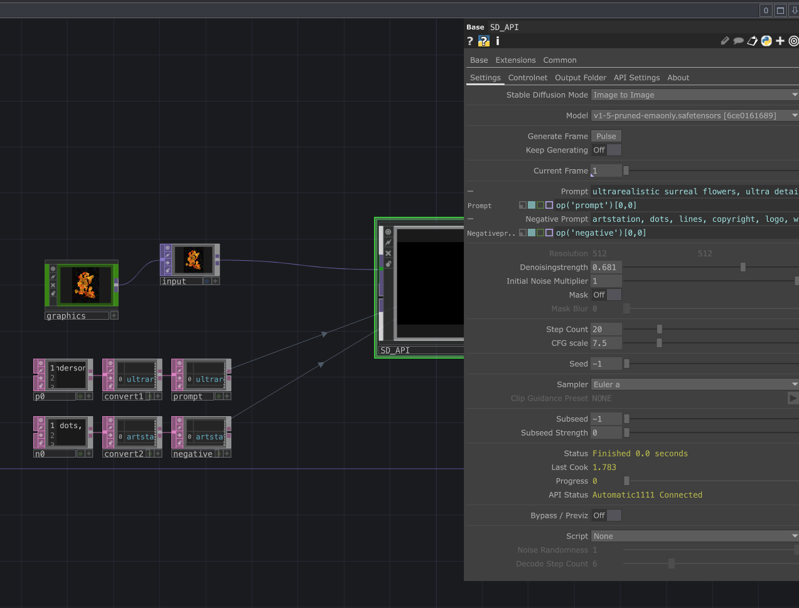

### Image generation settings
- Change denoising strength so the input image is combined with the generation
- Change step count for testing so its faster
- Change to a specific speed for consistency
- Change sampler to DPM++ 2M Karras

### Viewing the image in the background
- Add null after SD_API
- Set null to display

### Adding feedback loop
- Add another null, call it end point
- Add select top, drag null onto it
- Add transform in between stable diffusion output null and end point
  - Set scale to some slightly bigger value
- Add composite node
  - Add initial graphics output to node
  - Set operation to maximum
- Add level after select node
  - Connect to composite
  - Set opacity to .4 in post tab
- 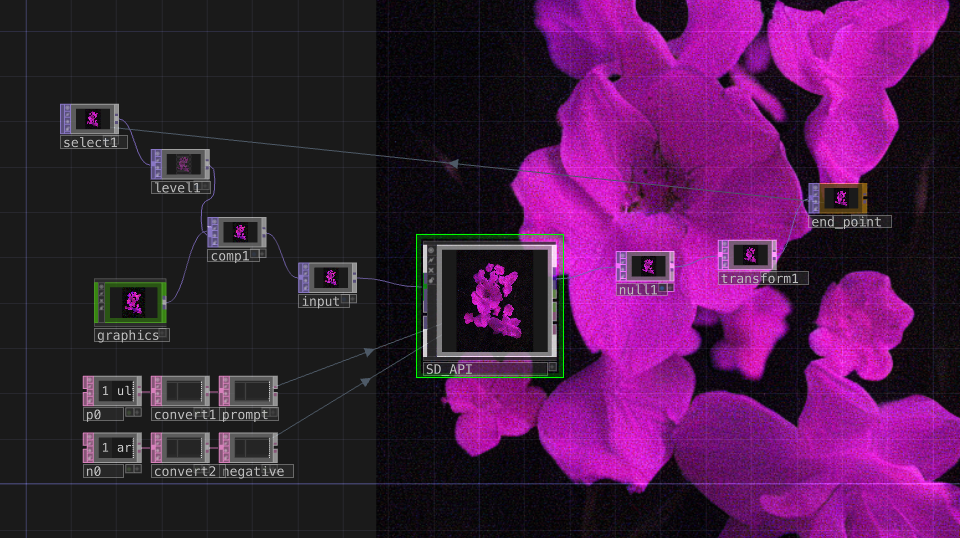
- Add sharpen node from Imagefilters
- Add HSV Adjust
  - Set Saturation to .9
- Add Anti Alias
  - Set Quality to Ultra
- Add null, call background
  - Set to display
- 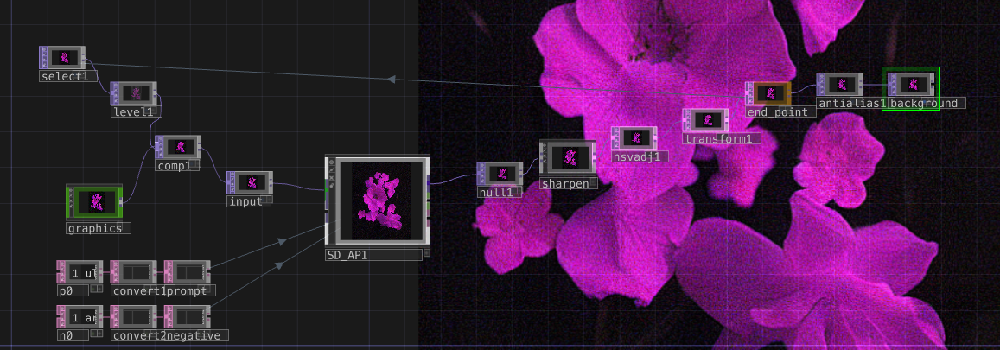

### Adding logic to change frame when image is generated
- Add null to chop output of SD_API
- Add select
  - Select current frame as channel name
- Add null after select
  - Add chop execute after
- Add logic after select
  - Change convert input to "on when value changed"
- Add delay after logic
  - Add delay of 1 frame
- Add null
  - Add chop execute after
  - Open code
    - Remove unused code, only work with "onOffToOn" and "onOnToOff"
    - Set actions to active in chop execute
    - Change code to:
    - 
- The setup now should look like this

### Adding movie file out
- Add movie file out after background$
  - Change type to stop frame movie
  - Change codec to mpeg 4
  - Enable unique suffix
    - Adjust path
  - Set audio chop to graphics/audio
    - Name depends on how we called the audio reactive graphics node
    - NOTE: rename the audiofilein to audio
  - Change audio bit rate to highest
  - Change movie fps to cookRate()
  - 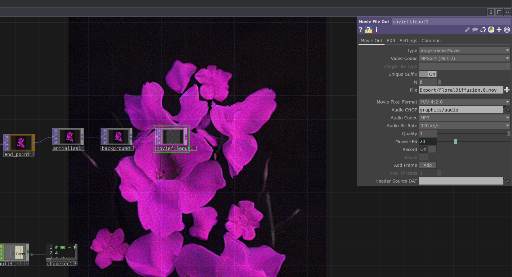

### Adding frames
- We need to add logic to add the frames to our recording
- On the chop exec from the sd_api, add logic to the onValueChange to add the frame:
- 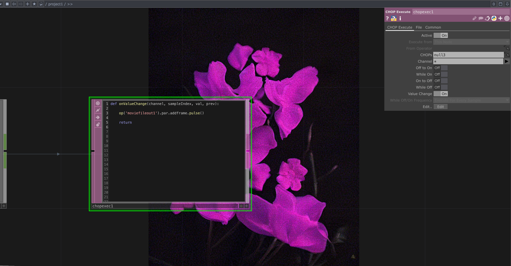

### Binding keep generating to record button
- Copy parameter from SD_API and bind with record
  - Copy parameter
  - Paste bind on record

### Start recording and generating images
- Start record
- Start pulse on SD_API

### Using gpuhub for generation
- To have better gpu, redirect the localhost requests to gpuhub
- Install nginx `brew install nginx`
- Start nginx `brew services start nginx`
- Edit `nginx.conf` usually located at `/usr/local/etc/nginx/nginx.conf`
- Configuration:
```
server {
    listen 7860;
    server_name localhost;

    location / {
        proxy_pass https://e1a8caa39813d2d95a.gradio.live/;
        proxy_set_header Host $host;
        proxy_set_header X-Real-IP $remote_addr;
        proxy_set_header X-Forwarded-For $proxy_add_x_forwarded_for;
    }
}
```

## Getting song information

### Spotify API
The Spotify API documentation is a helpful resource to get started: [Spotify API Documentation](https://developer.spotify.com/documentation/web-api)

## Resources

- [youtube.com - Sonic Flowers - TouchDesigner x StableDiffusion Tutorial](https://www.youtube.com/watch?v=4wpn_3JNaIc)

## Installing StreamDiffusion
[github.com - StreamDiffusion](https://github.com/cumulo-autumn/StreamDiffusion)

### Clone repo
`git clone https://github.com/cumulo-autumn/StreamDiffusion.git`

### Create virtual environment
```sh
python -m venv .venv
# Linux
source .venv/bin/activate
```