# TouchDesigner with Stable Diffusion Tutorial
Based on [youtube.com - elekktronaut - Touch Designer x Stable Diffusion Tutorial 1](https://www.youtube.com/watch?v=4wpn_3JNaIc)

## Setting up TouchDesigner Project
- Create new base
- Right click on base and `Add Component Time`
- 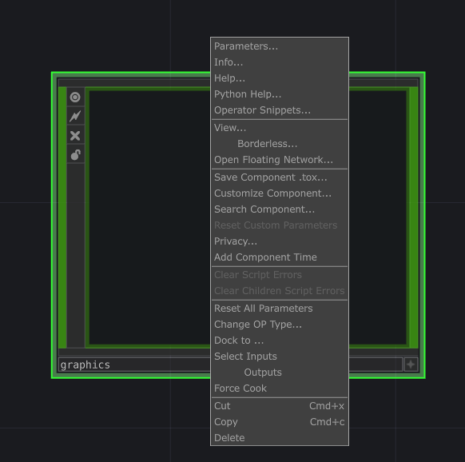
- Go inside base and then go inside local base
- Set the rate of the time to `cookRate()` and set play to 0
- 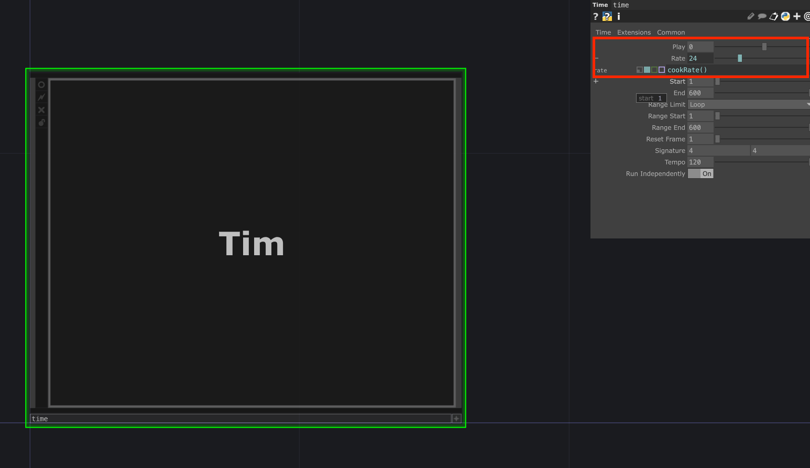
- Set the base to run independently
- 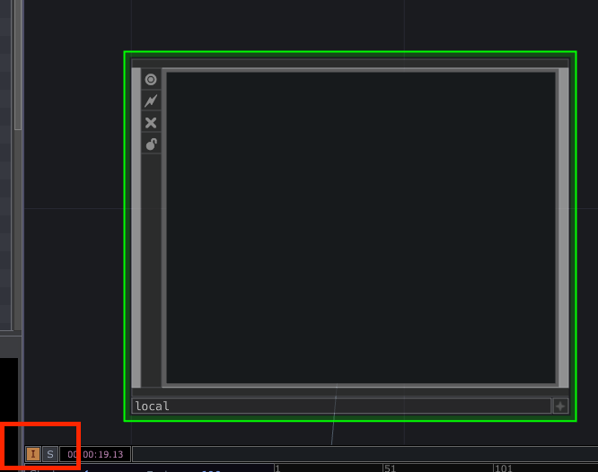

## Adding music
- Add audio file in chop
- Add info chop and drag the audio file in chop onto the info chop
- Set the file_length_frames as our timeline length
- 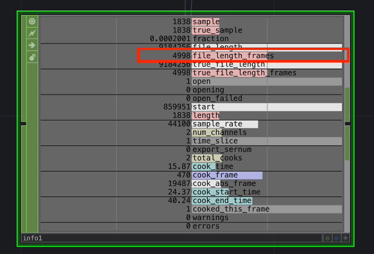
- 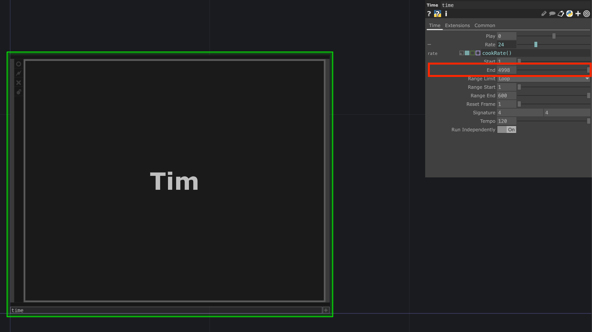
- Also set the range end to `me.par.end` to set the range to match the timeline
- Set the play mode of the audio file in to `Lcoked to Timeline` to navigate the audio on the timeline
- Add a audio device out after the audio file in

## Analying audio
- Add a math node after the audio file in and set combine channels to average. This will combine the two channels.
- Add audio spectrum after math
- Increase high frequency boost of audio spectrum
- Add a null afterwards
- right click and `collapse selected`
- The audio setup should look like this:
- 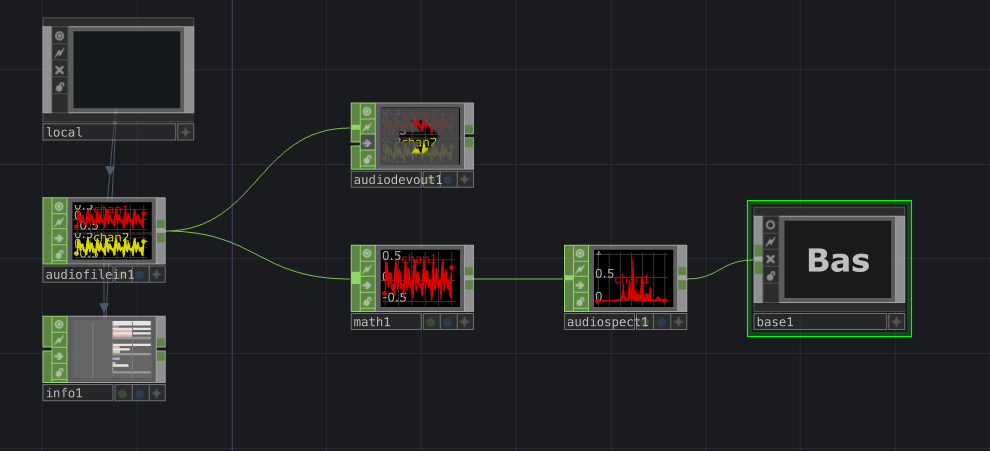

## Creating the audio reactive visual
### Create position and color of elements
- Navigate into the new base
- Add resample chop and set the sample rate to 60, this will provide us with the amount of elements that we will create later on
- Set time slice to off
- Add a chop to  and change pixel format to 32-bit float rgba
- 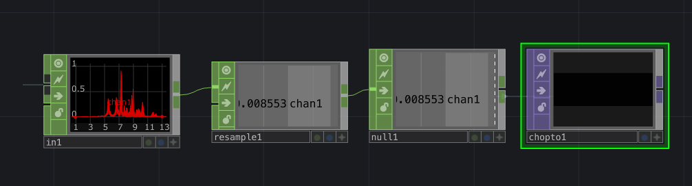
- Add noise
  - Set output to noise only
  - Set period to .2
  - Set harmonics to 0
  - Set offset to 0
  - Turn off monochrome
- Add math to change range later on
- Add null afterwards
- From chop to, add another noise node
  - Set output to noise only
  - Set exponent to .7
  - Set offset to .7
- Add lookup
- Add ramp as second input for lookup
- Set ramp colors
- Add null afterwards
- 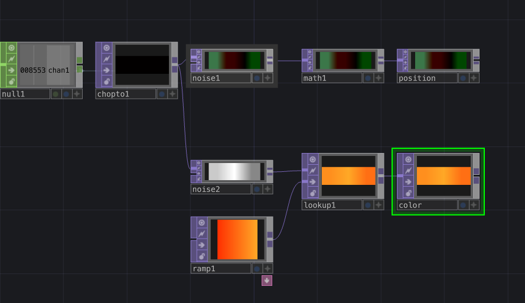

### Adding geometry
- Add circle sop
- Add transform sop
  - Change uniform scale to .2
- Add geometry comp
- Add camera
- Add render top
- 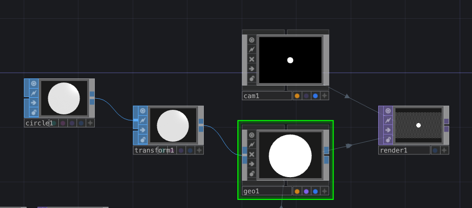
- Add constant material, drag onto geometry
- Add noise top, drag onto constant material
  - Set Amplitude to .1
  - Set offset to .9
  - Set period to 2
- 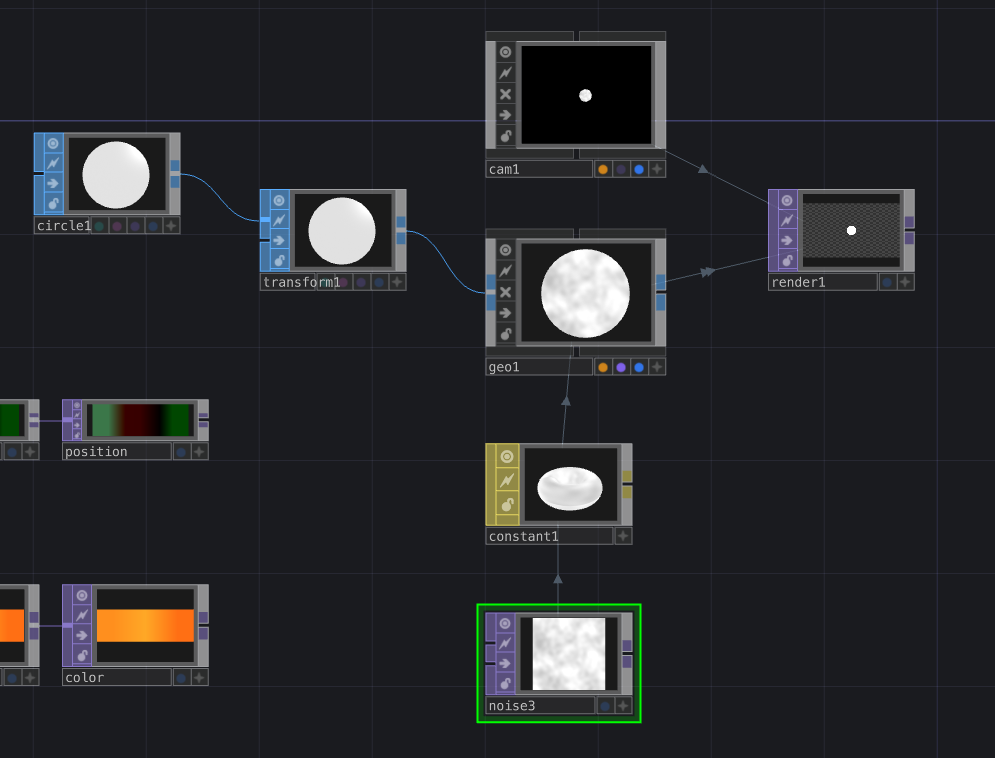
- Set resolution of render to someting reasonable that works well with stable diffusion
- E.g. 576x768
- Add out node after render node
- Set camera background color to 1
- 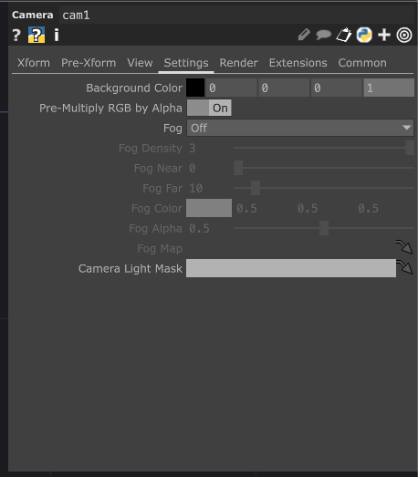

### Adding geometry instances
- Set the instancing to on on the geometry

#### Positioning the instances
- Set the position null as the Translate OP
  - Set Translate X ro r
  - Set Translate Y to g
- 
- Change to R and G range to better values in the math node that we created before(e.g. r to 3 and g to 4)
  - 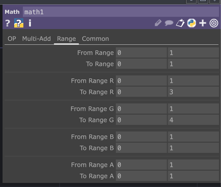

#### Adding color to the instances
- On the Instance 2 of the geometry, set the Color OP to color node
- Change the rgb to rgb of the color node
- 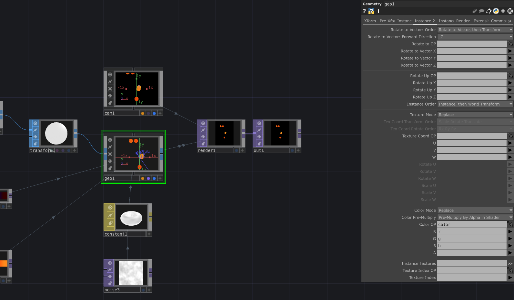

#### Adding rotation to the instances
- To change the rotation of the textures, add a noise after the noise that comes after the chop to
  - Set the output to noise only
  - Change seed
- Add math node after noise
  - Adjust to range to 0 to 360
- Add null, call it rotation
- Drag rotation null onto Rotate OP of Instance on Geometry
  - Set rotate z to r
- 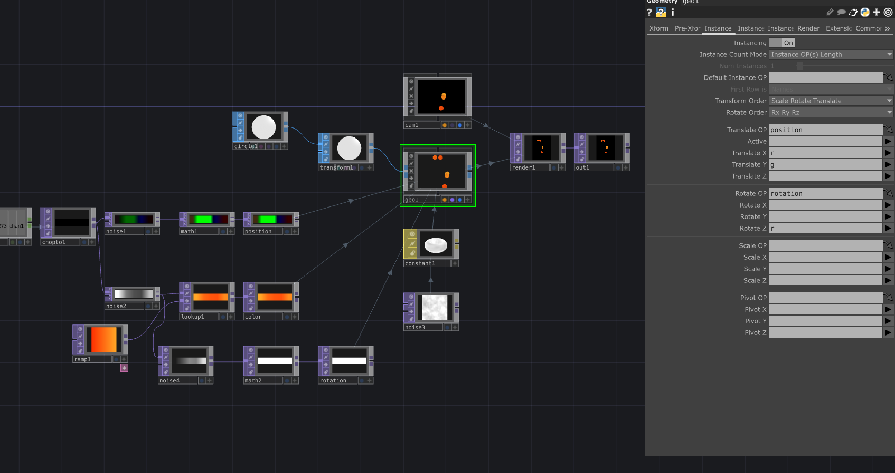

#### Adding scale to the instances
- From the resample node, add a math node
  - Set to range to .3 and 6
- Add lag
  - Turn on lag per sample
- Add null, call it scale
- Drag it onto geometry
- Use chan1 for x and y scale
- 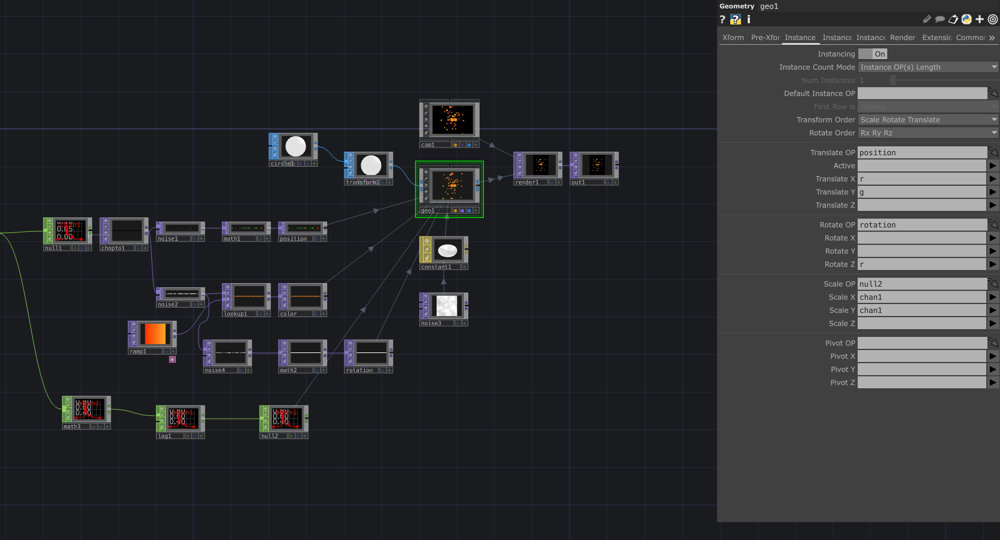

#### Adding animation
- From resample node, add analyze node
- Add math node
- Add lag node
  - Set lag start to .02
- Add speed node
- Add null node, call it animation
- Make the null viewer active
- Drag the null node onto the z translate of all three noises in geometry setup
  - Select chop reference
- This will push our noises forward in the animation
- 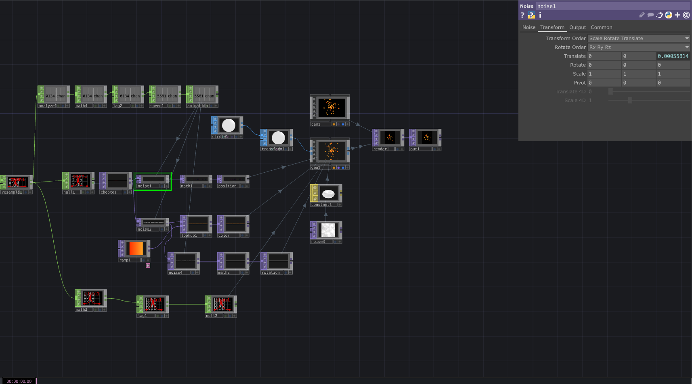

### Adding displacement
- Navigate out a layer
- Add displace node after the circles node
  - Set displace weight to .05 on both axes
- Add noise node after the circles node
  - Set output to just noise
  - Turn off monochrome
  - Connect to displace node
  - Set amplitude to .3
- 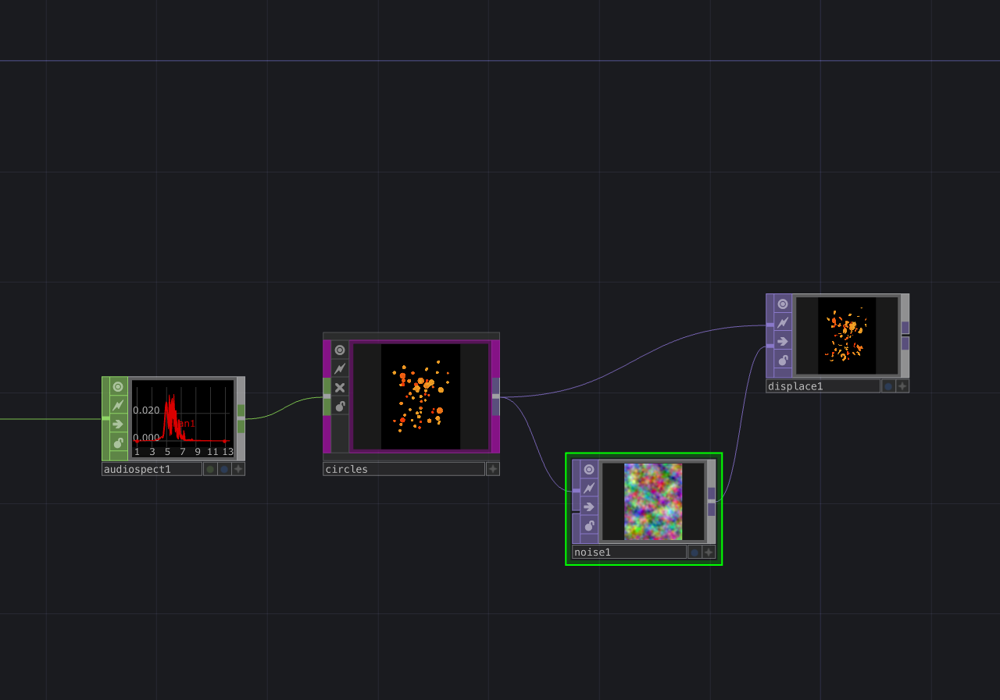

### Adding noise
- Add noise node
  - Set to Random GPU
  - Set amplitude to .2
  - Set offset to 0
  - Turn off monochrome
- Add another noise node
  - Set amplitude to .24
  - Set offset to .8
  - Set output to input * noise
- 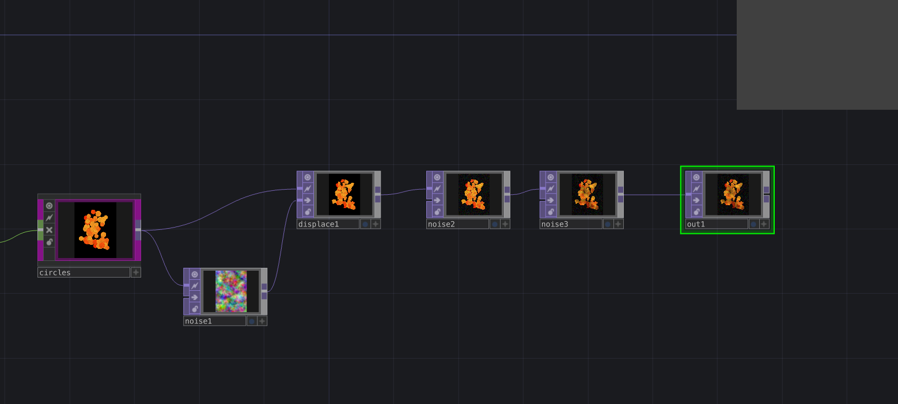

### Adding out node
- Add an out node

## Connecting audio reactive visual to stable diffusion
-  Navigate out a layer
-  Add null after base, call it input
-  Connect input to SD_API

## Set up SD_API
- Set web ui folder
- Launch web ui with --api flag
- Check if the port is matching with touchdesigner
- Change mode to image to image
- Select model to use

## Set up prompt window
- Add text dat
  - Call it p0
  - Insert prompt from tutorial: ultrarealistic surreal flowers, ultra detailed, texture, generative art, focus, wes anderson, kodak, light and shadow
- Add convert dat
- Add null, call prompt
- Drag null onto prompt of SD_API, add [0,0]
- Do the same steps for negative prompt
- Negative prompt
  - artstation, dots, lines, copyright, logo, watermark
- 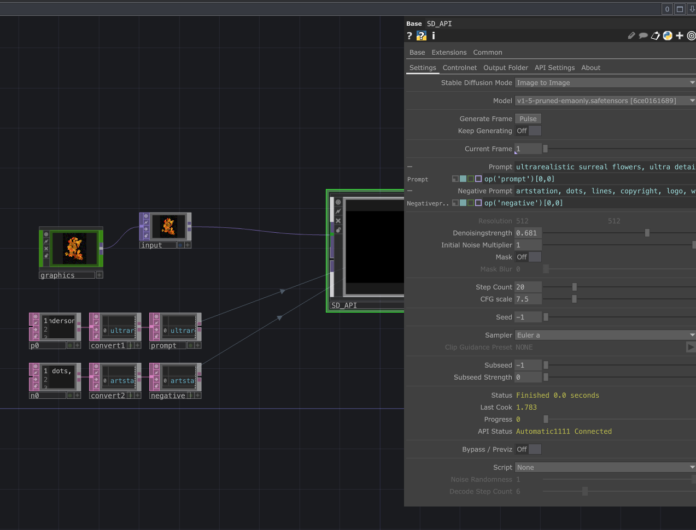

## Image generation settings
- Change denoising strength so the input image is combined with the generation
- Change step count for testing so its faster
- Change to a specific speed for consistency
- Change sampler to DPM++ 2M Karras

## Viewing the image in the background
- Add null after SD_API
- Set null to display

## Adding feedback loop
- Add another null, call it end point
- Add select top, drag null onto it
- Add transform in between stable diffusion output null and end point
  - Set scale to some slightly bigger value
- Add composite node
  - Add initial graphics output to node
  - Set operation to maximum
- Add level after select node
  - Connect to composite
  - Set opacity to .4 in post tab
- 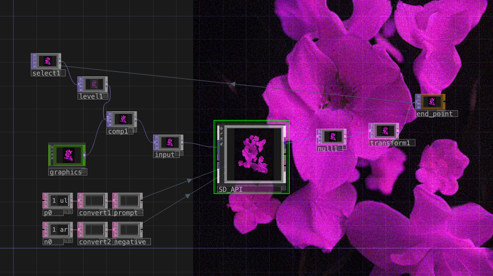
- Add sharpen node from Imagefilters
- Add HSV Adjust
  - Set Saturation to .9
- Add Anti Alias
  - Set Quality to Ultra
- Add null, call background
  - Set to display
- 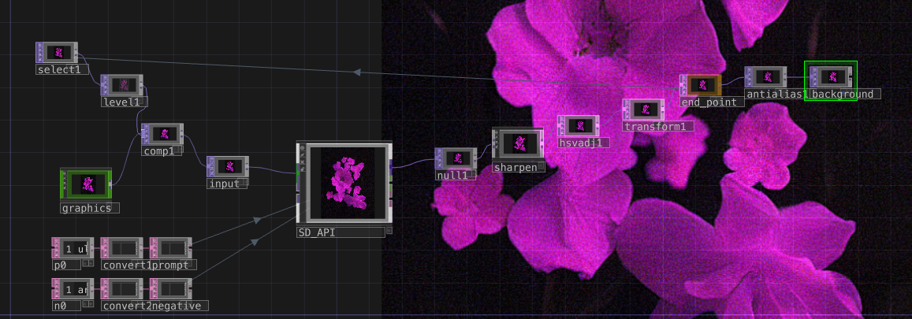

## Adding logic to change frame when image is generated
- Add null to chop output of SD_API
- Add select
  - Select current frame as channel name
- Add null after select
  - Add chop execute after
- Add logic after select
  - Change convert input to "on when value changed"
- Add delay after logic
  - Add delay of 1 frame
- Add null
  - Add chop execute after
  - Open code
    - Remove unused code, only work with "onOffToOn" and "onOnToOff"
    - Set actions to active in chop execute
    - Change code to:
    - 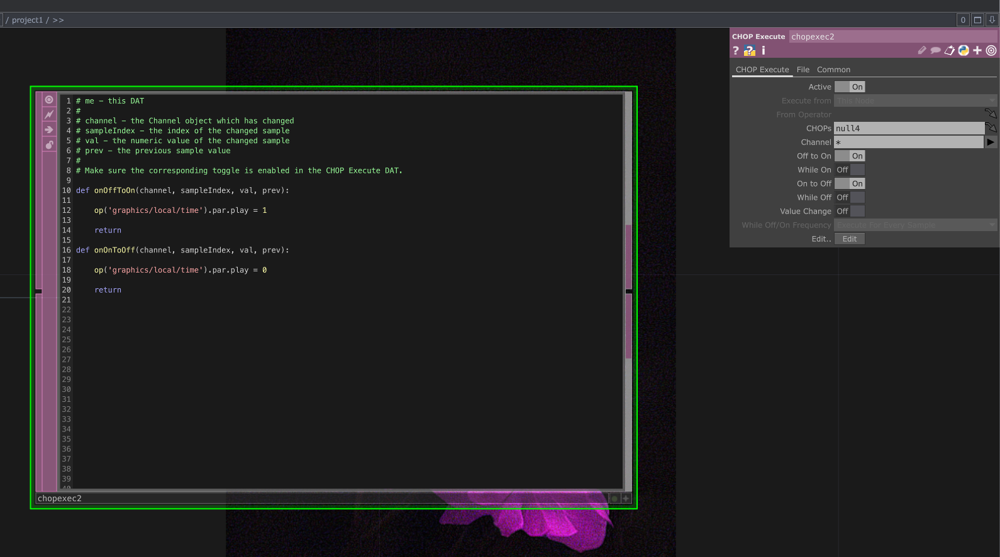
- The setup now should look like this

## Adding movie file out
- Add movie file out after background$
  - Change type to stop frame movie
  - Change codec to mpeg 4
  - Enable unique suffix
    - Adjust path
  - Set audio chop to graphics/audio
    - Name depends on how we called the audio reactive graphics node
    - NOTE: rename the audiofilein to audio
  - Change audio bit rate to highest
  - Change movie fps to cookRate()
  - 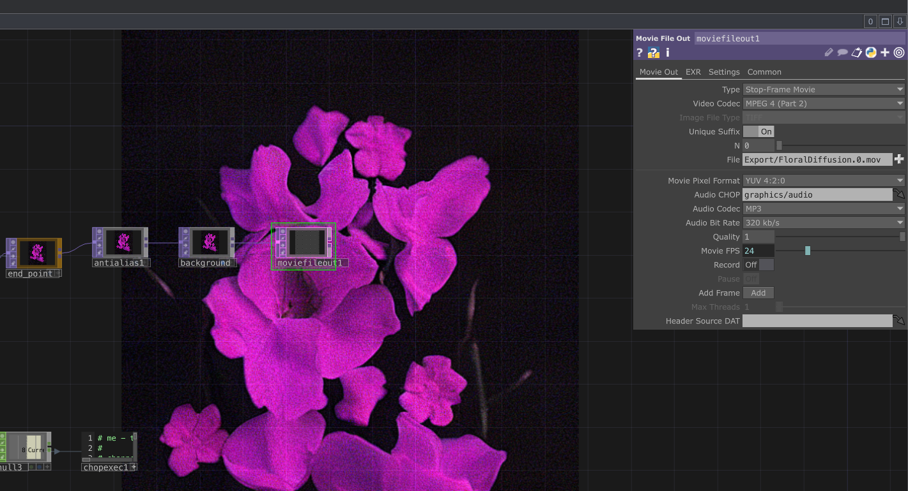

## Adding frames
- We need to add logic to add the frames to our recording
- On the chop exec from the sd_api, add logic to the onValueChange to add the frame:
- 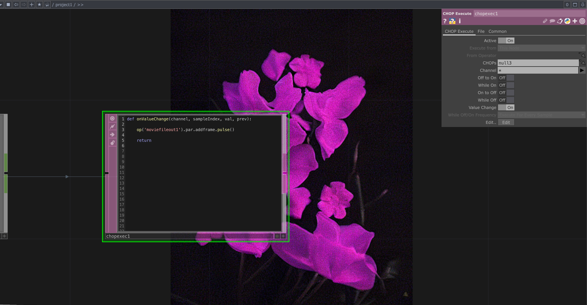

## Binding keep generating to record button
- Copy parameter from SD_API and bind with record
  - Copy parameter
  - Paste bind on record

## Start recording and generating images
- Start record
- Start pulse on SD_API
