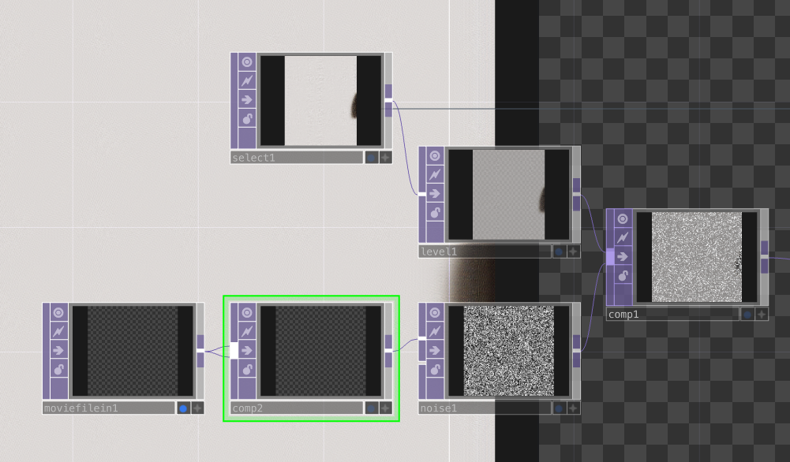
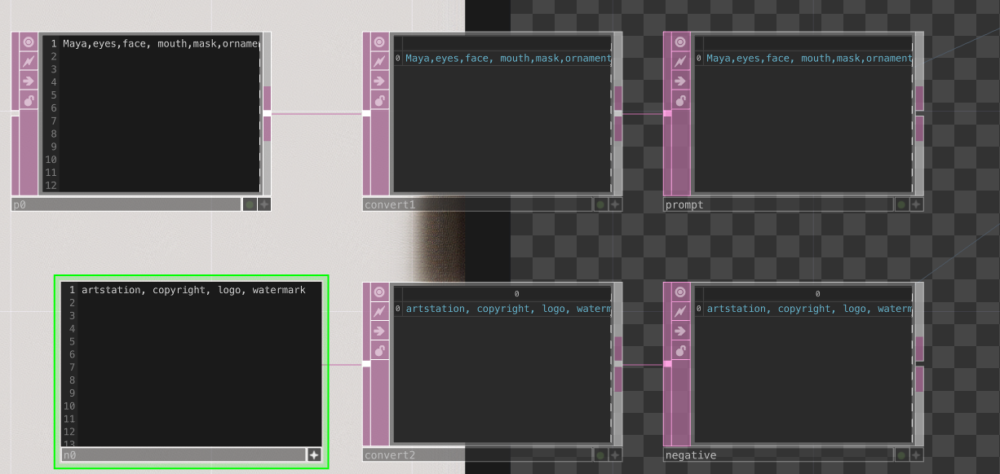
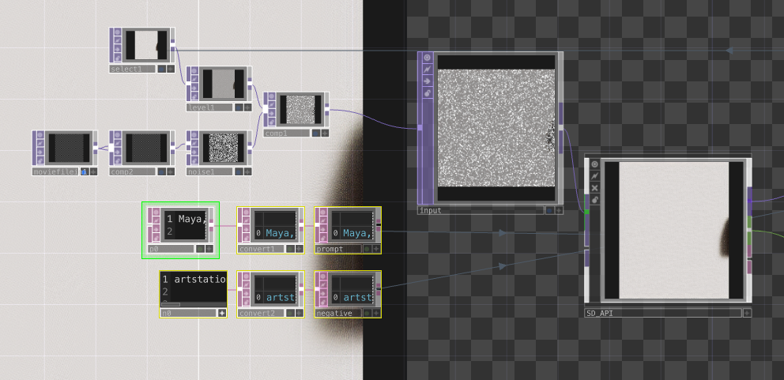
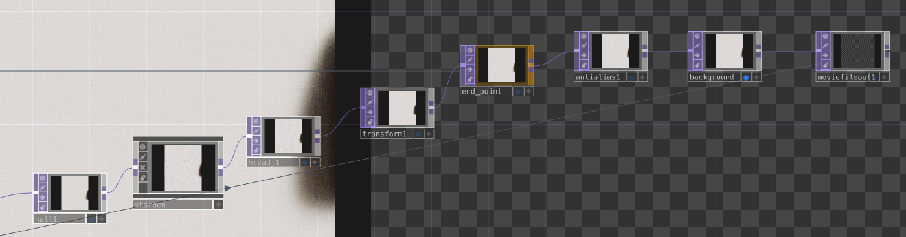
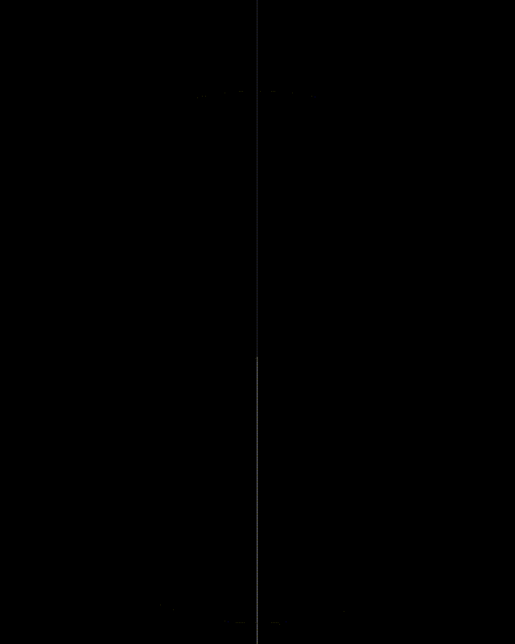
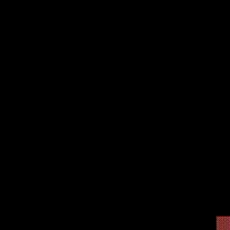
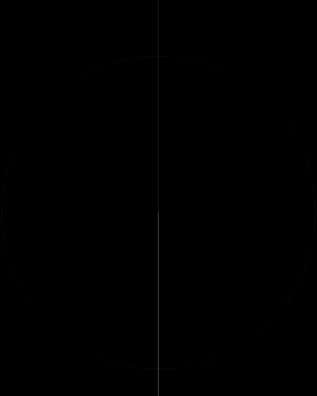
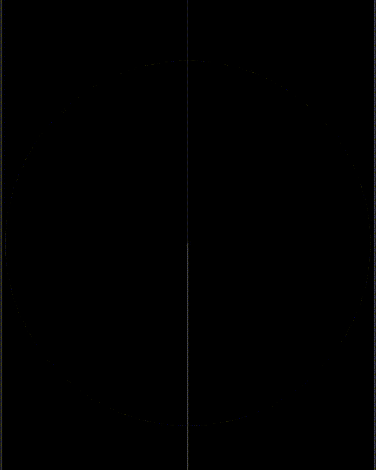
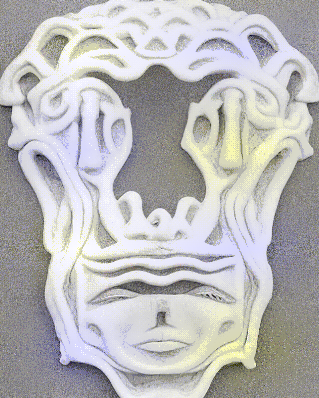

# Head diffusion
- [Head diffusion](#head-diffusion)
  - [Aduke Diffusion](#aduke-diffusion)
    - [Worflow](#worflow)
    - [Result](#result)
  - [Nailik](#nailik)
  - [Imochou](#imochou)


For this experiment, I wanted to create a timelapse animation which is based on a timelapse of a drawing of mine. Therefore I recorder myself while drawing a sketch. I sped the recording up and created a workflow in TouchDesigner to create the animation.

I experimented with various prompts that focussed on masks, ornaments and patterns.

## Aduke Diffusion
My heads all have a name, this animation was created based on "Aduke".

### Worflow
First, I created a movie file in, which is the timelapse of the drawing and combined it with noise.


Then I created text inputs for the prompt, where I used the following prompt:
```
Maya,eyes,face, mouth,mask,ornamental, sculpture, naturalism, ,black outline,quetzal,civilization,ultra detailed, texture, generative art
```

The prompt was adjusted several times, until I landed on the above.

I also used a negative prompt:
```
artstation, copyright, logo, watermark
```



The movie with noise and the prompt were then fed into the StableDiffusion component.



The generated image was the sharpened and the saturation adjusted.



The final image was also composited with the input, so that the images resembled each other.

The logic for creating the animation and playing the movie file in are the same as in the floral diffusion which is documented here:
- [Adding logic to change frame when image is generated](../floral-diffusion/floraldiffusion.md#adding-logic-to-change-frame-when-image-is-generated)

### Result

| Input                                                              | Output                                                               |
| ------------------------------------------------------------------ | -------------------------------------------------------------------- |
|  |  |

## Nailik
The setup for this head is the same as for the first one. However, I fine tuned the image generation settings to get a better result.I adjusted the denoisingstrength and also the initial nosie multiplier.


| Input                                                                 | Output                                                                  |
| --------------------------------------------------------------------- | ----------------------------------------------------------------------- |
|  |  |


## Imochou
The setup for this head is the same as for the first one. For this one, I did not use the timelapse, rather I experimented with a still image to experiment with Stable Diffusion settings.

| Input                                                | Output                                                 |
| ---------------------------------------------------- | ------------------------------------------------------ |
|  |  |