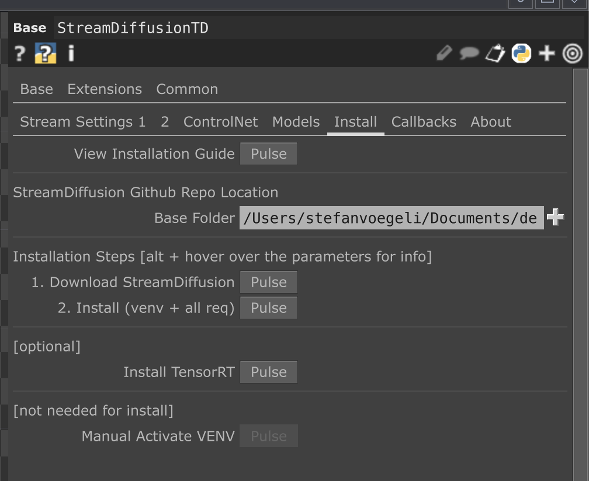
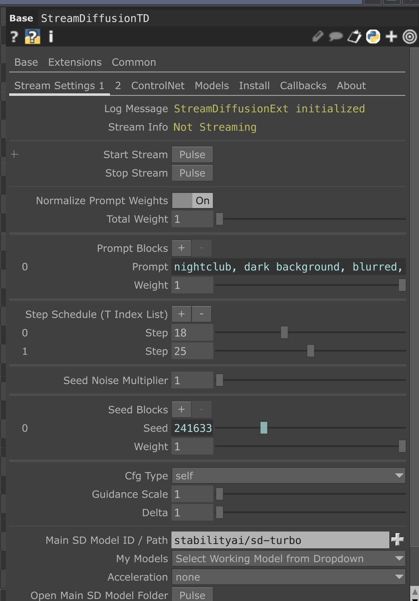
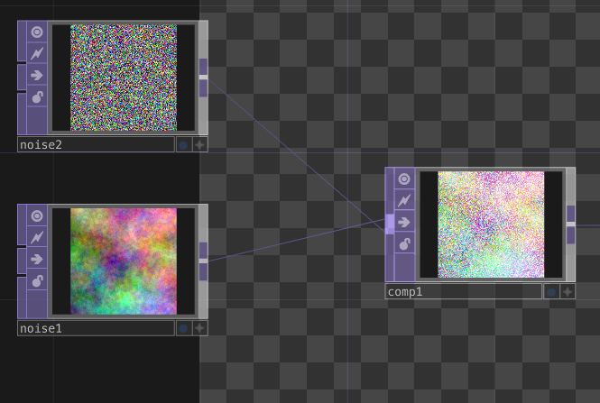
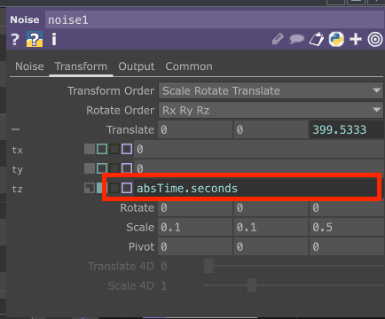

# StreamDiffusion
- [StreamDiffusion](#streamdiffusion)
  - [Installing StreamDiffusion](#installing-streamdiffusion)
    - [Create virtual environment](#create-virtual-environment)
  - [Running StreamDiffusion from TouchDesigner component](#running-streamdiffusion-from-touchdesigner-component)
  - [Creating the prompts](#creating-the-prompts)
    - [Prompt for keywords](#prompt-for-keywords)
  - [Adding the video file as another input](#adding-the-video-file-as-another-input)
  - [Results](#results)
    - [Psychedelic](#psychedelic)
    - [Anime](#anime)
    - [Lego](#lego)
    - [Realistic](#realistic)
    - [Oil painting](#oil-painting)


## Installing StreamDiffusion
An installation guide for StreamDiffusion is available on [github.com - StreamDiffusion](https://github.com/cumulo-autumn/StreamDiffusion).

By default, StreamDiffusion is not really developed with Mac in mind. Therefore, I did not follow the installation guide there.

In order to get StreamDiffusion running with TouchDesigner, there is a TouchDesigner Component by dotsimulate, which also provides easy installation.



Running it on Mac was not really straightforward. In order to get it running, I had to follow the installation, then create a virtual environment manually in the StreamDiffusion folder.

### Create virtual environment
```sh
python -m venv .venv
```

## Running StreamDiffusion from TouchDesigner component
The component also provided an easy way to run StreamDiffusion.


At first, the integration only worked halfway, meaning I only got the first frame, then no updates. I did not fully solve this problem yet, however it seemed that the problem was gone, once I started the Stable Diffusion web UI before running StreamDiffusion.

## Feeding Noise into StreamDiffusion
To create an image with StreamDiffusion, we can use noise in combination with a prompt.



In order to create an animation, the noise has to be animated which can be done by using `absTime.seconds`. In order to slow down the animation, this value can also be divided by a specific amount.



This resulted in a very basic animation: [onedrive.live.com - Love, Peace & Happiness v1](https://1drv.ms/v/s!AhXU9c-vzziSn-NGr2iGyGWJl5gqgA?e=d9QH9A)
On average, frame rate was about 2.5 fps.

## Creating the prompts
In order to have different prompts throughout the song, I wanted to timesync the prompt with the song. Luckily, someone already did the work to sync lyrics with a audiofile in operator: [github.com - TD_Lyrics](https://github.com/GuiGPaP/TD_Lyrics)

To get the timesynced lyrics, I had to do the manual work to correctly set the timestamps and create a .lrc file for the song.
> [Love, Peace & Happiness Lyrics](./lyrics/LovePeaceHappinessLyricsOnly.lrc)

### Prompt for keywords
As a first step, I used Bing AI to create keywords, that describe the lyrics of the song. For this, I used the following prompt:
```
Here is a line of a song text: "Brauchst paar schnelle Nächte"
What could be descriptive keywords for image generation? Please only respond with a comma separated list of keywords
```

I executed this for every line of the song and then created a .lrc file from this which resulted in [Love, Peace & Happiness Keywords from Lyrics](./lyrics/LovePeaceHappinessKeywords.lrc)

Result with basic keywords: [onedrive.live.com - Love, Peace & Happiness v2](https://1drv.ms/v/s!AhXU9c-vzziSn-NHph92d8QalA-cqQ?e=D4fzAH)

I fine tuned the keywords to fit the lyrics better several times:
- [Love, Peace & Happiness Keywords from Lyrics v2](./lyrics/LovePeaceHappinessKeywordsv2.lrc)
- [Love, Peace & Happiness Keywords from Lyrics v3](./lyrics/LovePeaceHappinessKeywordsv3.lrc)

Further results:
- [onedrive.live.com - Love, Peace & Happiness psychedelic](https://1drv.ms/v/s!AhXU9c-vzziSn-NJQ9cJmyq-labzrQ?e=2uF7wr)
- [onedrive.live.com - Love, Peace & Happiness neon](https://1drv.ms/v/s!AhXU9c-vzziSn-NKEMRt_4URJ-Xlug?e=ArRKSS)
- [onedrive.live.com - Love, Peace & Happiness v4](https://1drv.ms/v/s!AhXU9c-vzziSn-Q55jfXMW4vjLSPww?e=Gt52Tx)

## Adding the video file as another input
In order to get results that also resemble the original input video, I also added the original music video as another input and composited it with the noise.

Result with video as input: [onedrive.live.com - Love, Peace & Happiness with video input](https://1drv.ms/v/s!AhXU9c-vzziSn-RLOtuvO4oRhgedSw?e=r3KVCD)

## Results
In the end, I tried out various different visual styles with the v3 keywords. The frame rate is about 2.5 fps. This could be increased by using better hardware or slowing down the video input.

### Psychedelic
[onedrive.live.com - Love, Peace & Happiness - Psychedelic](https://1drv.ms/v/s!AhXU9c-vzziSn-ROMEwGCrcGYYsFow?e=kcxJlD)

### Anime
[onedrive.live.com - Love, Peace & Happiness - Anime](https://1drv.ms/v/s!AhXU9c-vzziSn-RQBnTKqoUL9DRUGQ?e=ySRKpY)

### Lego
[onedrive.live.com - Love, Peace & Happiness - Lego](https://1drv.ms/v/s!AhXU9c-vzziSn-RSFIRS0rgfONlslA?e=2uPN2R)

### Realistic
[onedrive.live.com - Love, Peace & Happiness - Realistic](https://1drv.ms/v/s!AhXU9c-vzziSn-RPeZbTq7XdKO8j-g?e=YBpiZP)

### Oil painting
[onedrive.live.com - Love, Peace & Happiness - Oil Painting](https://1drv.ms/v/s!AhXU9c-vzziSn-RRdHkjFmYQs7HTrA?e=7u5zL2)